<h3 align="center">
NGCBot V2.2
</h3>


<h5 align="center">
一个基于✨HOOK机制的微信机器人，支持🌱安全新闻定时推送【FreeBuf，先知，安全客，奇安信攻防社区】，👯Kfc文案，⚡漏洞查询，⚡手机号归属地查询，⚡知识库查询，🎉星座查询，⚡天气查询，🌱摸鱼日历，⚡微步威胁情报查询，
🐛视频，⚡图片，👯帮助菜单。📫 支持积分功能，⚡支持自动拉人，，🌱自动群发，👯Ai回复，⚡视频号解析，😄自定义程度丰富，小白也可轻松上手！
</h5>
<div style="text-align: center">
    <a href="http://ngc660.cn">
        
    </a>
    <a href="http://jiuansec.com">
    	
    </a>
    
    
    
    
</div>


## 💫 一、项目概述

Cheap_NGCBot代码来源于NGCBot，原来的版本太强大了，此版本只有ai对话功能，足够应付好友与群聊消息，图一乐。原项目在：[ngc660sec/NGCBot](https://github.com/ngc660sec/NGCBot)，推荐前往了解完整功能。

此外，在线api加入了**豆包**和随机选择，本地部署deepseek时可以**使用核显推理**，速度明显比cpu硬拉快，适合搞机玩家使用，将llm-cpp环境部署在本项目同一文件夹下可以自动调用ollama。[intel核显支持](https://github.com/intel/ipex-llm)，[核显部署ollama教程](https://qiita.com/Koji_Hataya/items/c3f473d8dd49bacd4a44#2-環境)

**本Bot是一款基于Hook机制的微信机器人，经过两年的更新迭代，目前功能更加面向大众，此项目会不定期维护，当然如果你有代码能力，也可以自己维护。目前支持功能(请看使用帮助)，最新支持功能：Ai(Gpt，星火，千帆，混元，月之暗面，智谱，DeepSeek)。如果你有更好的想法，请进群交流。转载此项目请勿标记原创，否则后果自负！！使用此项目人员请勿做违法犯罪行为，否则后果自负！！**

**注意⚠️注意⚠️：此项目完全开源，如果你是给钱了才用上本项目的，请注意，不要被坑了**

**原创作者：云山/eXM**

Cheap版本修改：Jaulin_Bage

**项目版本：NGCBot V2.2 蛇年贺岁版**

**官方公众号：NGC660安全实验室**

**如果你觉得此项目不错，可以给个Star或给个赞赏 关注一下公众号**，去原项目打赏吧~


## 📖 二、项目结构

```css
.
├── ApiServer																	# 接口服务文件夹
│   ├── AiServer															# Ai接口服务文件夹
│   │   ├── AiDialogue.py											# Ai接口主文件
│   │   └── sparkPicApi.py										# 星火 Ai 接口文件
│   ├── ApiMainServer.py											# 接口服务主文件
│   └── pluginServer													# 插件接口文件夹
│       ├── HappyApi.py												# 娱乐插件接口文件
│       ├── NewsApi.py												# 新闻插件接口文件
│       ├── PointApi.py												# 积分插件接口文件
│       ├── __init__.py												# 初始化接口服务文件
├── BotServer																	# 机器人服务文件夹
│   ├── BotFunction														# 机器人功能服务文件夹
│   │   ├── AdminFunction.py									# 管理员功能文件
│   │   ├── AdministratorFunction.py					# 超级管理员功能文件
│   │   ├── HappyFunction.py									# 娱乐功能文件
│   │   ├── InterfaceFunction.py							# 机器人接口功能文件
│   │   ├── JudgeFuncion.py										# 判断逻辑功能文件
│   │   ├── PointFunction.py									# 积分功能文件
│   ├── MainServer.py													# 机器人主服务文件
│   ├── MsgHandleServer												# 机器人消息处理文件夹
│   │   ├── FriendMsgHandle.py								# 好友消息处理文件
│   │   ├── GhMsgHandle.py										# 公众号消息处理文件
│   │   ├── RoomMsgHandle.py									# 群消息处理文件
├── Config																		# 配置文件夹
│   ├── Config.yaml														# 主配置文件
│   ├── ConfigServer.py												# 配置服务文件
│   ├── Feishu.yaml														# 飞书接口配置文件
│   ├── Finger.yaml														# 指纹配置文件(欢迎补充)
├── DbServer																	# 数据库服务文件夹
│   ├── DbDomServer.py												# 数据库操作文件
│   ├── DbGhServer.py													# 公众号数据库文件
│   ├── DbInitServer.py												# 数据库初始文件
│   ├── DbMainServer.py												# 数据库主服务文件
│   ├── DbPointServer.py											# 积分数据库服务文件
│   ├── DbRoomServer.py												# 群聊数据库服务文件
│   ├── DbSignServer.py												# 签到数据库服务文件
│   ├── DbUserServer.py												# 用户数据库服务文件
├── FileCache																	# 缓存文件夹
│   ├── FileCacheServer.py										# 缓存服务文件
├── OutPut																		# 消息输出文件夹
│   └── outPut.py															# 消息输出文件
├── PushServer																# 推送服务文件夹
│   ├── PushMainServer.py											# 主推送服务文件
├── logs																			# WCF日志文件夹
│   └── wcf.1.txt															# WCF日志文件
├── main.py																		# 启动文件
└── requirements.txt													# 依赖包文件
```

## ⚡️ 3、快速启动

### 3.1、Bot 快速启动

**注意：此Bot只能在Windowns系统上运行！！！无法在Linux上运行安装**

首先请克隆代码到本地，使用命令如下

```git
git clone https://github.com/Jaulin-Bage/Cheap_NGCBot.git
```

也可以直接Download

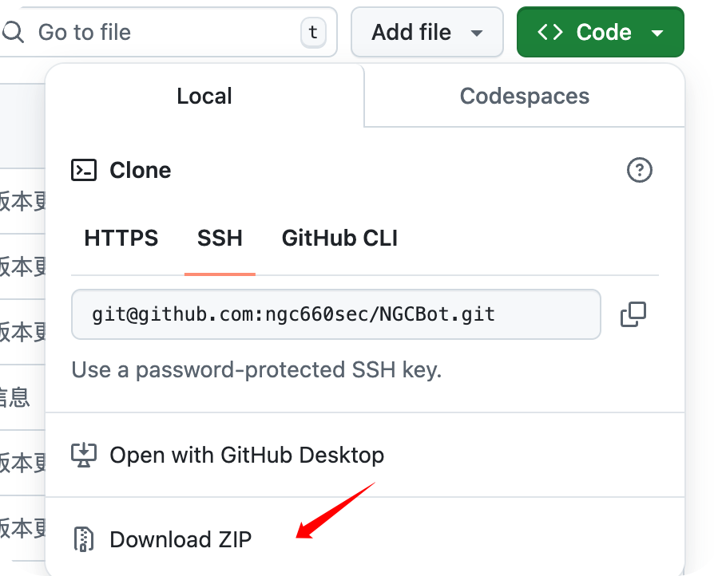

下载`Python`，使用`Python 3.8.10`版本 [点我下载](https://www.python.org/ftp/python/3.8.10/python-3.8.10-amd64.exe)

使用`pip`安装项目包（不懂就按顺序运行）

```bash
pip config set global.index-url https://mirrors.tuna.tsinghua.edu.cn/pypi/web/simple
python -m pip install --upgrade pip
pip install -r requirements.txt
```

安装完毕后你的 `WCF`版本应该是 `39.2.4.0`，请选择对应的微信进行下载

- `wcferry==39.0.12.0`：[WeChatSetup-3.9.2.23.exe](https://github.com/ngc660sec/NGCBot/releases/download/V2.0-龙年贺岁版/WeChatSetup-3.9.2.23.exe)
- `wcferry==39.2.4.0`：[WeChatSetup-3.9.10.27.exe](https://github.com/lich0821/WeChatFerry/releases/download/v39.2.4/WeChatSetup-3.9.10.27.exe)
- `wcferry==39.3.3`：[WeChatSetup-3.9.11.25](https://github.com/lich0821/WeChatFerry/releases/download/v39.3.3/WeChatSetup-3.9.11.25.exe)

安装完毕后，启动`main.py`文件

```
python main.py
```

出现以下界面，说明启动成功

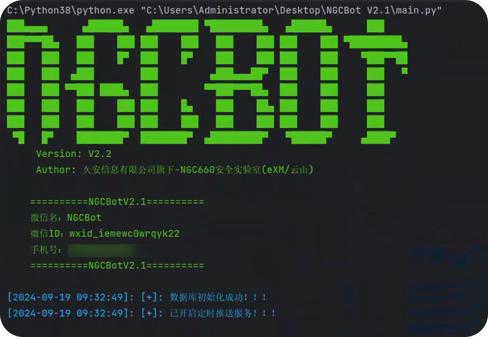

进入微信之后，会自动初始化必备文件

## 3.2、视频教程

视频已经上传至B站，Github放不了，要看的话大家去B站看即可

https://www.bilibili.com/video/BV1voqwYAEWs/


### 3.3、配置文件快速配置

如果启动成功，下一步配置所需的`Key`，**Ai 对话**等功能都需要用到 `Key`

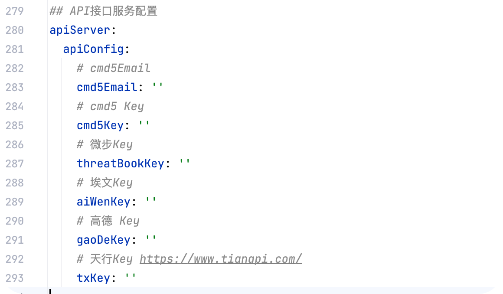

这些`Key`按需配置，如不配置则无法使用以下功能

```
1、MD5查询
2、微步IP查询
3、溯源定位
4、舔狗日记
```

以下 `Key`按需配置，如果只使用星火 Ai，那么配置星火Key 即可

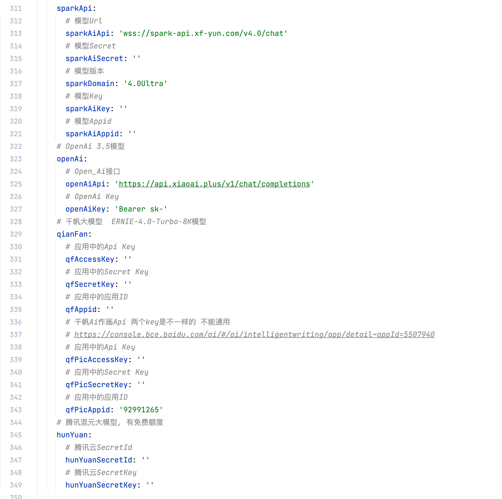

#### 3.3.1、各种 Key 配置

这里介绍几个比较难找的

**豆包**

火山官网：[火山引擎-云上增长新动力](https://www.volcengine.com/)，注册登录后进入控制台，找到火山方舟。

在线推理，创建接入点。按Token付费，但是有免费额度。


创建好后拿到模型的ID


找到ARK_API_KEY，可以作为环境变量直接存在系统里，而不需要设置临时环境变量。


requirements.txt没有补充，这个比较扯淡，需要安装一个package，第一次装大概率是失败的。这里需要改注册表，因为创建的文件夹长度超过了windows系统上限，[教程](https://blog.csdn.net/m0_66674794/article/details/140330611)。

```
pip install --upgrade volcengine-python-sdk[ark]
```

模型ID怎么用？在ApiServer/AiServer/AiDialogue.py中line:292, model=''中填入id。


**星火 Key 配置**

这里的模型版本采用的是`4.0Ultra`，如果要使用其它的，请自己修改此参数

进入[官网](https://xinghuo.xfyun.cn/)

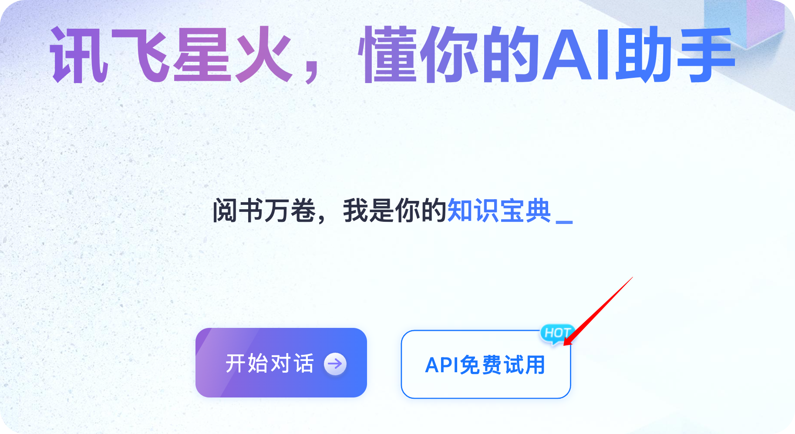

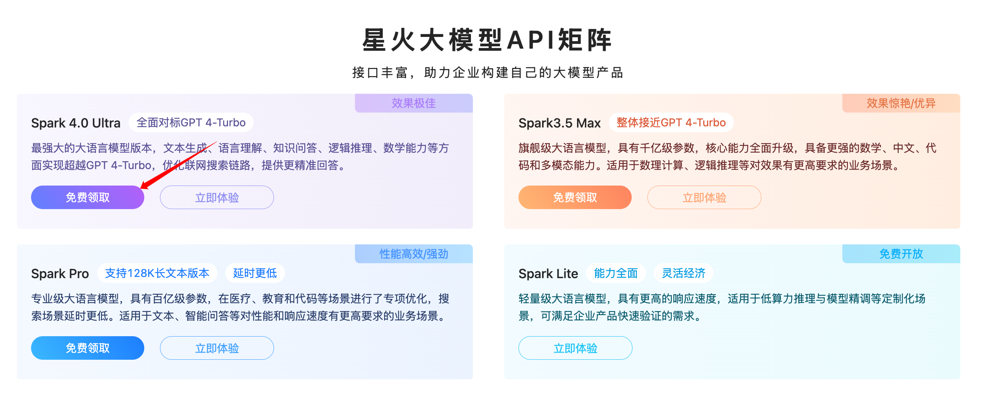

没有应用请先创建应用

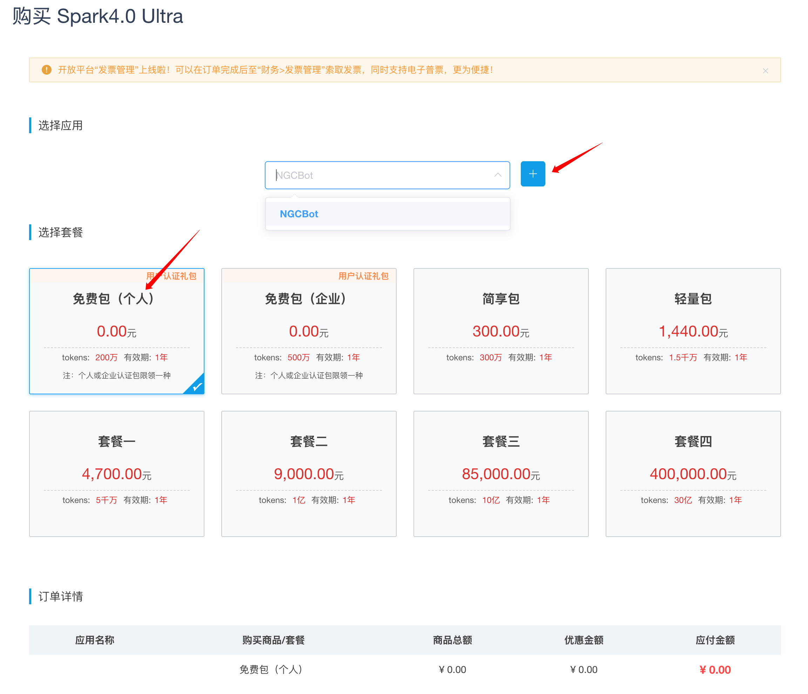

在 [我的应用](https://console.xfyun.cn/app/myapp) 中，点击你新建的应用，找到`Spark4.0 Ultra`

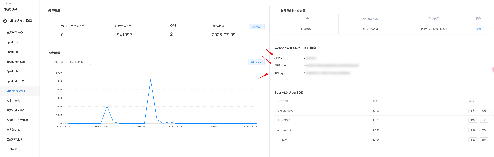

填入到配置文件中即可

**千帆 Key 配置**

进入到 [千帆官网](https://qianfan.cloud.baidu.com/) ，后台找到应用接入，点击创建应用

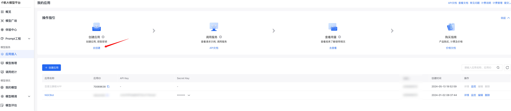

记下你的配置，填入到配置文件中即可，千帆模型没有免费额度，请充值使用！！

**Ai 作画(千帆)**

点击此 [链接](https://console.bce.baidu.com/ai/#/ai/intelligentwriting/app/detail~appId=5507940)

创建应用即可

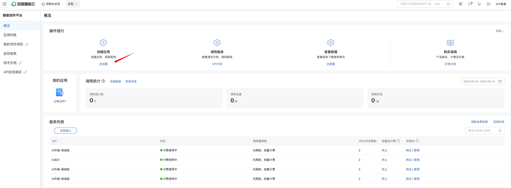

全选即可

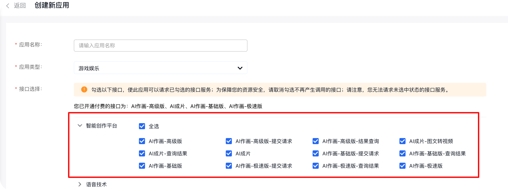

在应用列表中 找到你的应用，记下配置，填入到配置文件中，此功能也需要充值使用

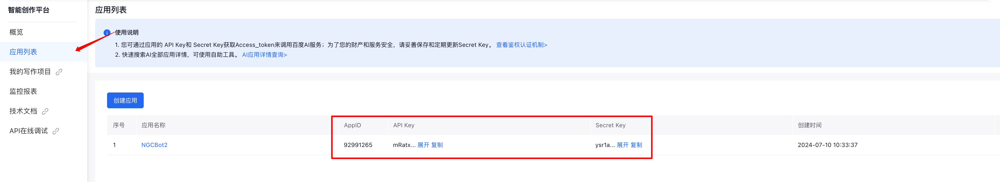

**腾讯混元配置**

这个要到腾讯控制台开通，点击[此处](https://console.cloud.tencent.com/hunyuan/start)跳转，开通后会自动赠送额度

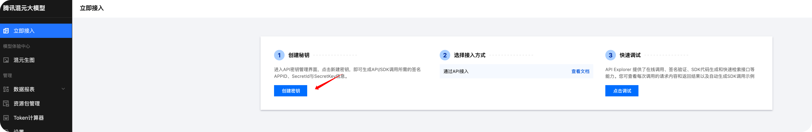

点击创建密钥

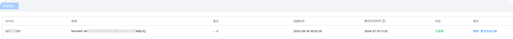

记下你所有的配置，然后填入到配置文件中即可

【2024.12.30】新增Key - DpKey

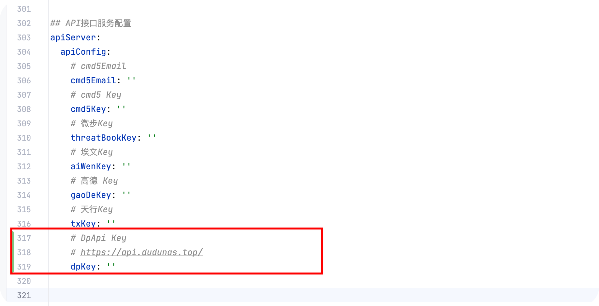

访问目标[官网](https://api.dudunas.top/)

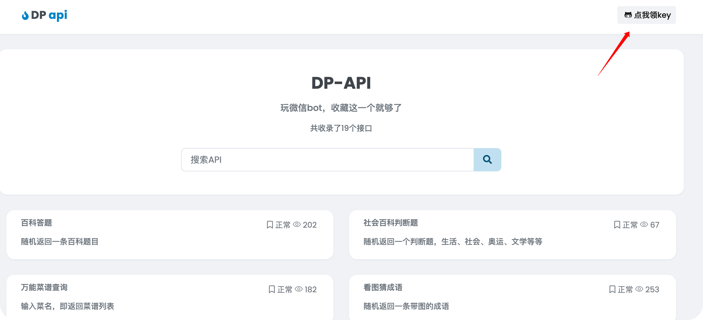

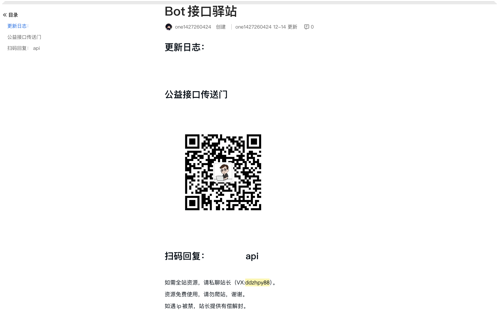

扫码添加即可

【2024.1.07】新增DeepSeek

访问目标[官网](https://www.deepseek.com/)

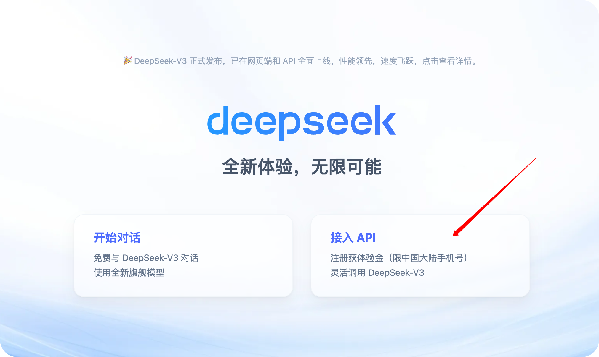

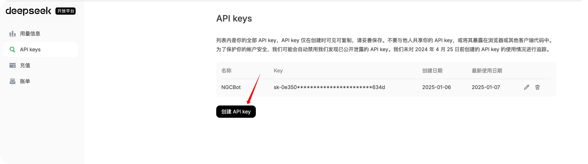

新人注册500w Token，总结群聊消息用的是此模型


## 🧐 4、使用帮助

### 4.1、第一次使用看这里

在运行成功后，你需要设置你的权限为超级管理员，当然你也可以设置多个超级管理员，拿到你的`wxid`即可。

给机器人发一条消息

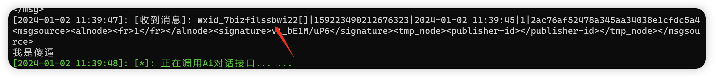

拿到此`wxid`，放到配置文件当中即可

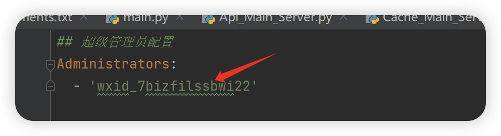

若添加多个超级管理员，请按格式添加！

### 4.2、功能介绍，只保留了积分功能

#### 4.2.1、积分功能，开放使用无需积分

1. Ai 对话
2. Ai 画图


**画图功能**

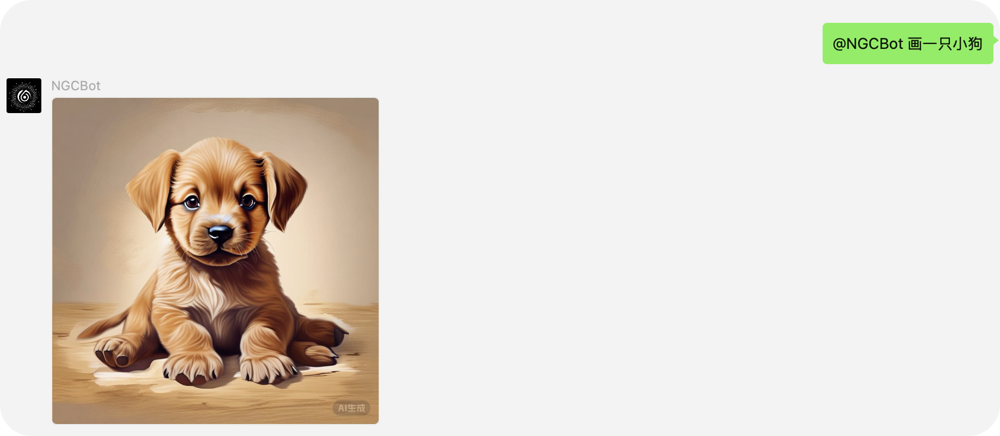

**注意：与好友对话只触发 Ai 功能和关键词回复功能**


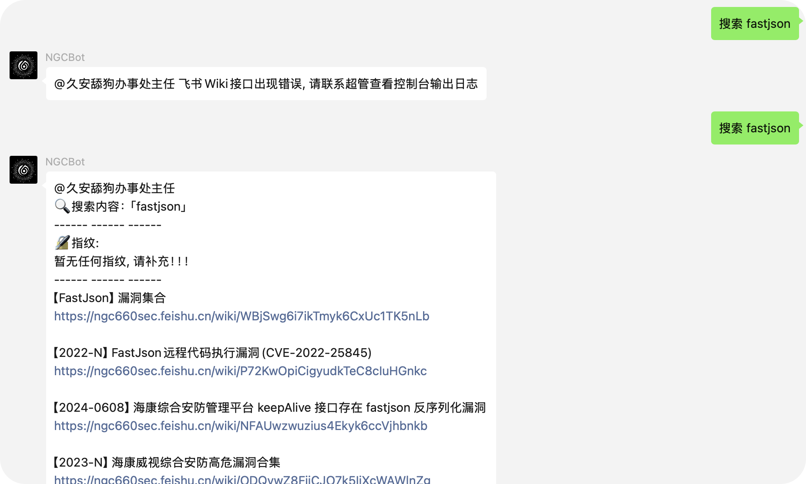

如果出现接口错误的提示，请重新输入关键词即可


## ❓ 5、一些常见的问题

**有问题！看配置文件！看配置文件！看配置文件！有些人配置文件不配置，在这问为什么用不了？那我问问你你不拿碗不拿筷子怎么吃饭？**

其它问题，若是Bug请提供给群主即可，配置文件空着的都要自行配置，这里并不提供

```
1、启动失败问题

- 在任务管理器中关闭微信，重新打开即可
```

```
2、使用的Ai画图关键词，但是触发的是 Ai 对话功能

- 机器配置不太够，导致去除@人的名字时 没有去除成功
```

```
3、机器配置多少才够

- 按理说 4h8g 即可，主要是不要调用的太频繁
```

```
4、为什么我的表情包功能使用不了?

- 没输入下载命令，或者版本过低
```

```
5、为什么我自动通过好友失败

- wcf 版本为 39.2.4.0 时，无法使用自动通过好友功能以及自动接收转账功能
```

```
6、为什么我好友 Ai 对话没用

- Ai 对话开关没开，或者 Key 未配置
```

```
7、提示注入失败

- 检查wcf版本和微信版本是否一致
```

### ❌ 5.1、Bug提交处

关注微信公众号，后台留言（不做回复，请进群交流），添加机器人回复 `Bot交流群` 拉你进群！（机器人不常开，看到会拉群）

<div style="display: flex;">
  
   
</div>


### 💰 5.2、会员群聊处

**前言**：在项目更新的过程中发现许许多多的同学不会配置项目，也有许多的同学想要接入自己的API但又没学过 `Python` 。所以今天（2024,12,04）宣布建立会员交流群，主要解决以下几个问题：

1. 不会配置项目，不会启动项目
2. 接入API问题，不会接入自己的API
3. 想要实现自己的功能，比如（客服）
4. 等等... ...

进入付费群聊后会在群内进行指导必要时可提供远程协助，另外会开设特定课程如：Python基础课程，机器人使用教程（视屏），API接入课程（指南），等等(还没想好)

另外还会发布机器人+其它大模型的结合使用教程

价格暂定：（**99**）

付费时效：**终生**

联系方式：

<div style="display: flex;">
  
</div>

### ❗️  5.3、谨防诈骗

如下：

首先此项目启动不需要VPN，另外跟有没有公网IP也没有关系，只需要你电脑配置能登微信，能联网即可

<div style="display: flex;">
  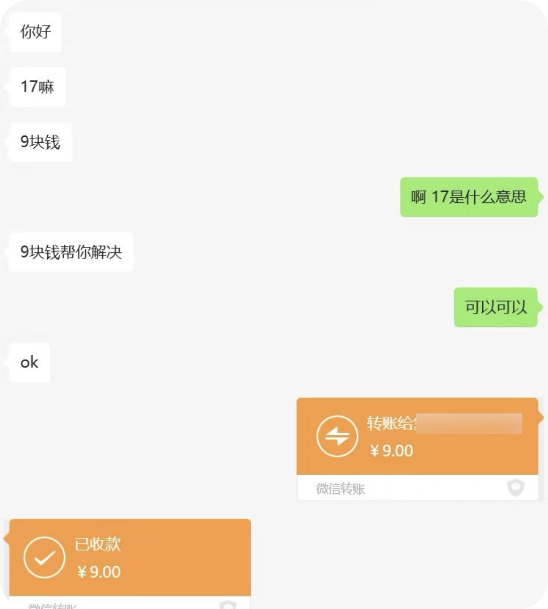
   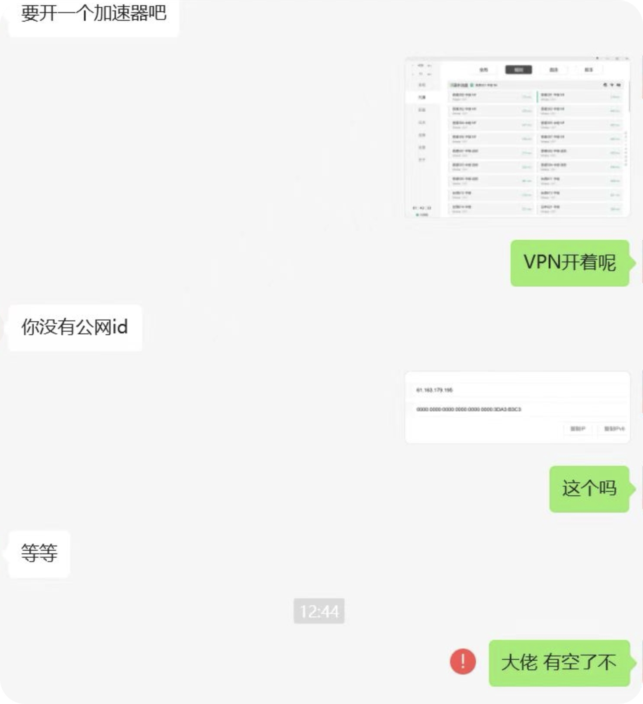
</div>


## 📝 6、更新日志

```css
- 【2022.12.8】 推送Bot 1.0版本，为初始版本
- 【2022.12.17】推送Bot 1.2版本，新增部分接口，重写部分代码，新增积分功能
- 【2023.1.1】  推送Bot 1.3版本，重写部分代码，优化代码逻辑，优化积分功能，优化定时推送功能
- 【2023.3.6】  推送Bot 1.4版本，总体代码优化，优化定时推送，优化积分功能，新增消息转发，维护API服务调用
- 【2023.3.29】 推送Bot 1.4.1版本，增加多线程处理消息，重写AI接口。可能会出现消息串群，@错人的问题，等后续优化更新
- 【2023.3.31】 推送Bot 18诞辰版，修复1.4.1版本，消息乱串问题，支持AI上下文检索，优化消息处理代码，实现功能分区分块处理,由于挂了代理之后，当调用ai对话接口时，会出现ERROR报错，这种问题是正常的，能弄到国外服务器就别用国内的
- 【2023.5.4】  推送Bot v18.1诞辰版,修复AI上下文消息过多无法回复的问题，修复天气查询小BUG
- 【2023.9.10】 推送Bot v1.5版本,优化AI回复,积分功能,代码逻辑,新增MD5解密功能
- 【2024.1.2】  推送Bot V2.0龙年贺岁版，框架重写！逻辑重构！更快！更稳！更多功能！
- 【2024.07.15】推送Bot V2.1版本 框架再次重写，逻辑再次重构，更快！更稳！删减一些不必要功能，新增Ai画图功能
- 【2024 09.10】推送Bot V2.2版本 新增飞书WIki查询，需要手动对接飞书知识库，修复一些存在的Bug，新增一些功能，请查看配置文件
- 【2024 12.30】推送Bot V2.2蛇年贺岁版 新增抖音视频解析，视频号解析，塔罗牌功能，优化一些代码，修复一些Bug
- 【2025.1.07】 推送Bot V2.2蛇年贺岁版功能更新，新增群聊消息总结，群聊发言排行榜，潜水榜，撤回消息监测，新增DeepSeek大模型
```


## 🙏🏻 7、鸣谢：

https://github.com/lich0821/WeChatFerry

感谢查克大佬提供的微信Python库！！！大家可以使用此框架进行开发！

## 😘 8、支持

感谢以下团队的大力支持

- NGC660安全实验室
- CKCSec安全研究院
- 渊龙Sec安全团队

## 👈 9、感谢国产社区GitCode

如果无法访问 `Github` 也可以访问 `GitCode`

<div style="display: flex;">
  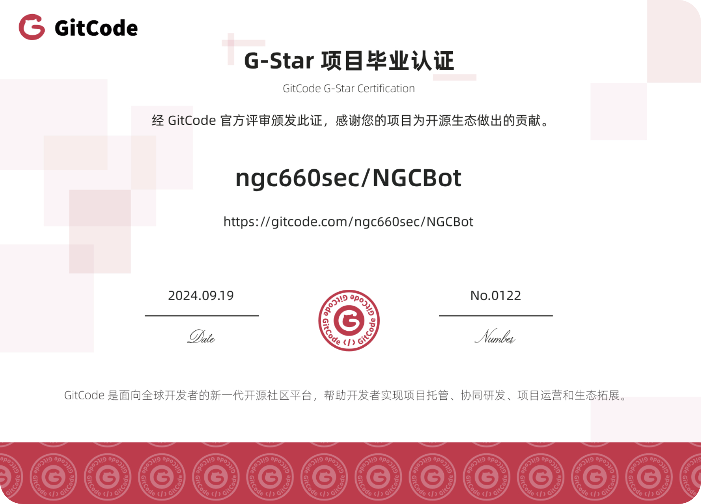
</div>


 <picture>
   <source media="(prefers-color-scheme: dark)" srcset="https://api.star-history.com/svg?repos=ngc660sec/NGCBot&type=Date&theme=dark" />
   <source media="(prefers-color-scheme: light)" srcset="https://api.star-history.com/svg?repos=ngc660sec/NGCBot&type=Date" />
   
 </picture>
